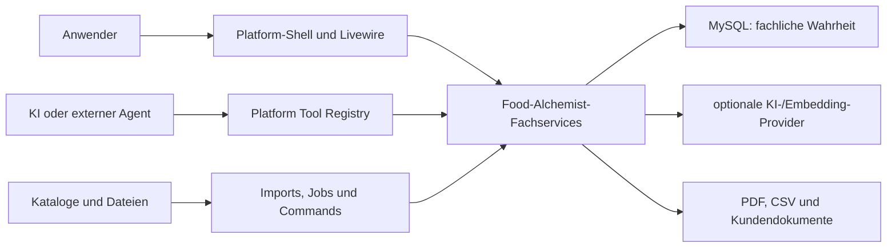
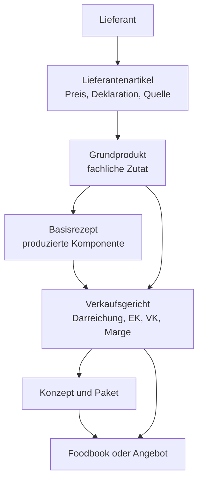

# Architektur — Food Alchemist

- **Zweck:** verbindliche technische Orientierung für Entwicklung, Review und Betrieb
- **Zielgruppe:** interne und externe Entwickler, Architektur, Produkt und Betrieb
- **Stand:** 28.07.2026
- **Strategischer Rahmen:** [Zielbild 2029](Zielbild_2029_und_Huerden_Food_Alchemist.md)
- **Aktuelle Lücken:** [MVP-Audit](PLANUNG/23_MVP_Audit.md) und
  [Zielbild-Plan](PLANUNG/24_Zielbild_2029_Umsetzungsplan.md)

Dieses Dokument beschreibt die beabsichtigte und heute überwiegend vorhandene
Architektur. Bekannte Abweichungen werden ausdrücklich als solche markiert.

## 1. Systemkontext

Food Alchemist ist ein Laravel-Package innerhalb der Platform-Shell. Die Shell
liefert Anmeldung, Teamkontext, Navigation und die gemeinsame Tool-Infrastruktur.
Food Alchemist besitzt seine fachlichen Tabellen, Services, Livewire-Oberflächen,
Jobs, Befehle und Tool-Adapter selbst.



### Deploymentgrenze

- Das Modul wird nicht separat deployed.
- Der Service Provider registriert Config, Views, Migrationen, Livewire-Komponenten,
  Routen, Policies, Jobs und Tools in der Host-Anwendung.
- Demo und Produktion verwenden MySQL.
- Die lokale Sandbox bindet das Modul per Composer-Path-Repository ein.
- SQLite ist Test-Harness, aber kein produktionsgleiches Datenbanksystem.

## 2. Fachlicher Kern

### Produkt- und Datenkette



Die Kette ist nicht nur Navigation. Sie bestimmt Berechnung und Vererbung:

- Preise laufen vom konkreten Lieferantenartikel nach oben.
- Yield und Mengen beeinflussen Einstand und Portion.
- Allergene, Zusatzstoffe und Nährwerte werden aus den verwendeten Bestandteilen
  aggregiert.
- Änderungen können abhängige Rezepte, Gerichte, Konzepte und Dokumente veralten
  lassen.
- Kundenfähige Ergebnisse benötigen eine nachvollziehbare Quelle und einen
  Freigabestatus.

### Klassifikationsachsen

Zwei Achsen dürfen nicht vermischt werden:

1. **Zutatenklassifikation:** Warengruppe, Unterkategorie und Grundprodukt. Sie
   unterstützt Suche, Disposition, Matching und Deklaration.
2. **Verkaufsklassifikation:** Hauptgruppe, Gerichtsklasse und Aufschlagsklasse. Sie
   unterstützt Portfolio, Foodbook, Kalkulation und Preisbildung.

## 3. Laufzeit- und Datenschichten

| Schicht | Hauptverantwortung | Beispiele |
|---|---|---|
| Routes/Livewire | Authentifizierter Einstieg, Validierung, UI-Zustand | Browser, Editor, Cockpits |
| Tools | Maschinenlesbare Adapter mit `ToolContext` | `*.GET`, `*.POST`, `*.PUT` |
| Jobs/Commands | Import, Batch, Wartung, Wiederaufnahme | Katalogimport, Recompute, Qualität |
| Services | Fachliche Use Cases, Transaktionen und Invarianten | Recipe, Price, Foodbook, Pairing |
| Policies/Scopes | Sichtbarkeit, Ownership und Autorisierung | Teamhierarchie, Policy-Prüfung |
| Models | Relationen, Casts und lokaler Zustand | `FoodAlchemist*`-Models |
| MySQL | Persistente Wahrheit und transaktionale Rechenbasis | `foodalchemist_*`-Tabellen |

### Abhängigkeitsregel

Web, Tools, Jobs und Commands dürfen Fachlogik nicht getrennt voneinander
implementieren. Sie rufen denselben Service-Use-Case auf. Services dürfen nicht von
Livewire oder Blade abhängen.

```text
erlaubt:  UI/Tool/Job -> Service -> Model/DB
nicht:    Service -> Livewire
nicht:    Tool -> eigene Preis- oder Tenant-Logik
nicht:    View -> DB-Abfrage oder Geschäftsberechnung
```

## 4. Mandantenmodell

Food Alchemist verwendet hierarchische Vererbung:

- `team_id = NULL`: globaler Seed oder globaler Referenzwert
- `team_id = Root-Team`: zentral kuratierter Masterbestand
- `team_id = Kundenteam`: kundeneigener Bestand

Für ein Team gilt:

```text
sichtbar   = globale Datensätze ∪ Datensätze der Team-Ancestry
editierbar = ausschließlich Datensätze mit team_id des aktuellen Teams
```

`BelongsToTeamHierarchy::visibleToTeam()` und `Support\TeamScope` bilden die
Leseregel ab. Es gibt bewusst keinen globalen Eloquent-Scope, da Commands und
Importe auch ohne angemeldeten Benutzer arbeiten.

### Verbindliche Schreibregel

Jeder schreibende Pfad muss:

1. den Teamkontext aus Authentifizierung, `ToolContext` oder explizitem Jobkontext
   beziehen,
2. das Zielobjekt als **eigenen** Datensatz auflösen,
3. jede referenzierte ID zusätzlich im sichtbaren oder eigenen Teamraum prüfen,
4. die Änderung und abhängige Berechnungen transaktional ausführen,
5. einen negativen Cross-Tenant-Test besitzen.

`visibleToTeam()` allein ist ausdrücklich keine Berechtigung für `update()` oder
`delete()`.

### Bekannte Abweichung

Der aktuelle Code setzt diese Regel nicht in allen Livewire- und Servicepfaden
konsistent um. Das ist ein Release-Blocker und Phase 0 des
[Zielbild-Plans](PLANUNG/24_Zielbild_2029_Umsetzungsplan.md).

## 5. Berechnungs- und Wahrheitsmodell

### Eine Formel pro fachlicher Wahrheit

- Rezeptkosten, Yield und Deklarationsaggregation laufen über zentrale
  Recompute-Services.
- Darreichung und Marge verwenden zentrale Services.
- Simulationen dürfen die produktive Wahrheit nicht still verändern.
- Exporte lesen dieselbe freigegebene Wahrheit wie die UI.
- Rundung findet an definierten fachlichen Grenzen statt, nicht zufällig je View.

### Herkunft und Aktualität

Für entscheidungsrelevante Werte müssen mindestens Quelle und Aktualität ermittelbar
sein. Für importierte oder KI-angereicherte Felder kommen Confidence,
Freigabestatus und gegebenenfalls manuelle Übersteuerung hinzu.

Zielreihenfolge für konkurrierende Quellen:

```text
explizit freigegebene manuelle Kuration
  > vertraglich priorisierte Lieferantenquelle
    > normaler Import
      > geerbter Masterwert
        > KI-Vorschlag
```

Die genaue Feldmatrix ist noch als Zielbild-Arbeit zu finalisieren. Bis dahin darf
ein Import einen manuell kuratierten Wert nicht still überschreiben.

### Preiswahrheit

Ein Preis ist nur entscheidungsfähig, wenn Artikel, Lieferant, Einheit,
Gültigkeitszeitraum, Erfassungszeitpunkt und Quelle bekannt sind. „Letzter Wert“ und
„gültiger aktueller Wert“ sind nicht automatisch dasselbe. UI, Kalkulation und
Export müssen veraltete oder fehlende Preise sichtbar machen.

## 6. KI, Wissen, Pairing und Tools

### KI-Grundregel

KI ist Vorschlags- und Analyseebene. Deterministische Datenbank- und Fachlogik
entscheidet über Tenantzugriff, Berechnung, Freigabe und Persistenz.

- Prompts erhalten kuratierten Wissenskontext.
- Ergebnisse speichern Quelle, Modellkontext und Confidence, soweit fachlich nötig.
- Unsichere Ergebnisse landen in einer Prüfstrecke.
- KI-Ausfall muss als Betriebszustand sichtbar sein und darf Kern-CRUD nicht
  unbrauchbar machen.

### Foodpairing

Foodpairing ist SQL-nativ. Vorberechnete Scores und Aroma-/Moleküldaten liegen in
MySQL. Es gibt keinen produktiven Neo4j- oder SPARQL-Pfad. Ein heuristisches Ergebnis
muss als heuristisch gekennzeichnet bleiben.

### Tool-Ebene

Tools sind eine alternative Oberfläche auf vorhandene Use Cases:

- Teamkontext kommt aus `ToolContext`.
- Reads verwenden dieselben Scopes wie Webpfade.
- Writes verwenden dieselben Services und Policies.
- Registrierungsfehler werden künftig geloggt und über Healthchecks sichtbar.
- Bei einem Fachmodell-Change werden Tool-Schema, Tests und Dokumentation im selben
  Arbeitspaket angepasst.

## 7. Importe und Exporte

### Importe

Importe sind untrusted input und benötigen:

- festgelegtes Eingangsverzeichnis und Schutz vor Path Traversal/Symlinks,
- Formatvalidierung und verständlichen Fehlerbericht,
- Dry-Run, wo fachlich sinnvoll,
- idempotente Wiederholung,
- team- und ownership-sichere Auflösung,
- Feld-Provenienz und explizite Überschreibungsregeln,
- Recompute beziehungsweise Folgejob nach erfolgreichem Commit.

### Exporte

- PDF und CSV dürfen nur für den aktuellen Teamkontext erzeugt werden.
- CSV-Felder müssen gegen Spreadsheet-Formeln neutralisiert werden.
- Haftungsrelevante Inhalte zeigen Freigabe und Aktualität oder blockieren den
  finalen Export.
- Kundendokumente dürfen keine internen Confidence- oder Diagnosewerte offenlegen,
  sofern sie nicht ausdrücklich Teil des Produkts sind.

## 8. Nebenläufigkeit und Batchverarbeitung

- Große Imports, Recomputes und Qualitätsläufe gehören in resumierbare Jobs oder
  Commands.
- Jobs tragen einen expliziten Team- und Korrelationskontext.
- `withoutOverlapping` schützt nur vor Parallelität, nicht vor fachlicher
  Idempotenz; beides ist erforderlich.
- Externe Aufrufe benötigen Timeout, begrenzte Retries und eine sichtbare
  Fehlerablage.
- Lange Transaktionen über Netzwerkaufrufe sind zu vermeiden.

## 9. Qualität, Tests und Betriebsfähigkeit

### Testpyramide

| Ebene | Zweck |
|---|---|
| Unit | Formeln, Resolver, Parser und lokale Invarianten |
| Feature | Service-, DB-, Livewire-, Tool- und Tenantverhalten |
| MySQL-Smoke | Datenbankspezifische Migrationen und Queries |
| Browser/E2E | echte Nutzerstrecken und JavaScript-Interaktion |
| Golden/Performance | Solver, Recompute, Import und Dokumenterzeugung |
| Realfall-Gate | echter Kunden-Foodbook-Durchlauf ohne Experteneingriff |

Tests dürfen ausschließlich auf einer explizit erlaubten Testdatenbank laufen.
Eine technische Allowlist dafür ist noch umzusetzen.

### Mindest-Observability

Künftig zu messen sind mindestens:

- Importerfolg, Abweisungen und Konflikte je Quelle,
- Datenqualitätsbefunde und Zeit bis zur Behebung,
- Anteil fehlender beziehungsweise veralteter Preise,
- Recompute-Dauer und Fehler,
- Solver-Modus, Kandidatenzahl und Laufzeit,
- Tool-Registrierungs- und Ausführungsfehler,
- KI-Kosten, Latenz und manuelle Korrekturquote je Kunde,
- Freigabestatus haftungsrelevanter Kundendokumente.

## 10. Produkt- und Modulgrenzen

Im Modul liegen:

- kulinarische Stammdaten und Lieferantenbezug,
- Rezepte, Gerichte, Darreichungen und Kalkulation,
- Konzepte, Pakete, Foodbooks und Angebote,
- Qualitäts-, Pairing-, Wissens- und KI-Unterstützung,
- einfache, aus Foodbooks abgeleitete Produktions- und Bestellvorschläge, soweit sie
  der kalkulierbaren und bestellbaren Ergebnisstrecke dienen.

Nicht Ziel des Moduls sind:

- vollwertige Lagerwirtschaft und permanente Bestandsführung,
- Buchhaltung, Faktura und Zahlungsverkehr,
- Touren- und Personalplanung,
- ein allgemeines ERP,
- eigenständige graphbasierte Infrastruktur ohne belegten Produktnutzen.

Die Grenze bei Produktion und Bestellung ist bewusst schmal: Food Alchemist darf
den fachlich berechneten Bedarf erzeugen und einfach ausführbar machen. Komplexe
operative Lager-, Logistik- oder ERP-Prozesse gehören in Nachbarmodule über stabile
Contracts.

## 11. Architekturentscheidungen und Änderungen

Eine Änderung benötigt eine dokumentierte Architekturentscheidung, wenn sie:

- Datenbesitz oder Tenantvererbung verändert,
- eine neue persistente Wahrheitsquelle einführt,
- Modulgrenzen verschiebt,
- Kernformeln oder Haftungsfreigaben verändert,
- einen neuen externen Provider zwingend macht,
- eine neue Synchronisationsrichtung einführt.

Die Entscheidung enthält Problem, Optionen, gewählte Lösung, Konsequenzen,
Migration und Rückweg. Bis ein eigener ADR-Ordner etabliert ist, wird sie in der
zugehörigen aktiven Spezifikation unter `PLANUNG/` festgehalten und von hier
verlinkt.
