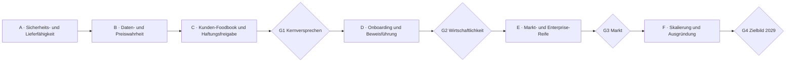

# Food Alchemist — Umsetzungsplan zum Zielbild 2029

- **Status:** aktiv
- **Stand:** 28.07.2026
- **Owner der Planung:** Produkt und Technik
- **Strategische Quelle:** [Zielbild 2029](../Zielbild_2029_und_Huerden_Food_Alchemist.md)
- **Technische Ausgangslage:** [MVP-Audit](23_MVP_Audit.md) und
  [archivierte Übergabe vom 28.07.2026](../_archiv/2026-07-28_dokumentationsbereinigung/PLANUNG/_UEBERGABE_2026-07-28.md)

## 1. Zweck dieses Plans

Das Zielbild enthält den vollständigen Board-Fahrplan mit 66 Meilensteinen und den
Gates G0 bis G4. Dieses Dokument übersetzt ihn in eine ausführbare Produkt- und
Engineering-Reihenfolge.

Es beantwortet vier Fragen:

1. Was muss zuerst stabilisiert werden, bevor neue Breite entsteht?
2. Welcher technische Nachweis erfüllt welchen Zielbild-Meilenstein?
3. Welche Arbeit kann parallel erfolgen und welche liegt auf dem kritischen Pfad?
4. Wann darf ein Status von „gebaut“ auf „betriebsfähig“ oder „Gate erfüllt“ wechseln?

Dieser Plan ersetzt nicht die Fachspecs. Er priorisiert und verbindet sie.
Die vollständige Bottom-up-Sicht auf große und kleine Produktoberflächen steht in
der [Business-Case-Funktionsmatrix](25_Business_Case_Funktionsmatrix.md). Beide
Dokumente bilden gemeinsam die Lieferplanung: dieser Plan steuert Gates und
Abhängigkeiten, die Matrix verhindert, dass kleine Funktionen zwischen den Gates
verschwinden.
Prompts, Retrieval, Embeddings und die 128 maschinellen Tools werden ergänzend in
der [LLM-/MCP-Funktionsmatrix](26_LLM_MCP_Funktionsmatrix.md) gesteuert.

## 2. Ausgangslage am 28.07.2026

### Vorhanden

- breite fachliche Abdeckung von Lieferantenartikeln bis Foodbook und Angebot,
- SQL-native Kalkulation, Recompute, Pairing und Qualitätssignale,
- Web-, Tool-, Import-, Produktions- und Bestellpfade,
- große automatisierte Modultestsuite,
- Zielbild, Hürden und Board-Meilensteine bis Ende 2029,
- technischer Demo- und Fixture-Nachweis einzelner Kernstrecken.

### Noch nicht belastbar bewiesen

- durchgängige Mandantentrennung bei allen öffentlichen Aktionen,
- sicherer Testbetrieb ohne Risiko für persistente Datenbanken,
- reproduzierbare Dependency- und CI-Kette,
- ein echter Kunden-Foodbook-Durchlauf ohne Domänenexperten,
- Import-Prioritäten für Kunde, Master, Lieferant und KI,
- haftungssichere Freigabe von Allergenen und Nährwerten,
- aktuelle Preise als sichtbare und messbare Produktwahrheit,
- Laufzeit und Ergebnisqualität am realistischen Zielvolumen,
- Betriebsaufwand und KI-Kosten je Kunde.

### Konsequenz

Bis Abschluss von Phase A gilt **Stabilisierung vor Feature-Ausbau**. Ausnahmen sind
nur Arbeiten, die ein Zielbild-Gate direkt nachweisbar machen oder einen
Produktionsblocker beheben.

## 3. Statusmodell

Jedes Arbeitspaket verwendet genau einen Status:

| Status | Bedeutung |
|---|---|
| `offen` | noch nicht begonnen |
| `in Arbeit` | Owner und nächster Nachweis sind benannt |
| `gebaut` | Code oder Dokument existiert; lokale technische Tests sind grün |
| `integriert` | kompletter Pfad in der Platform-Shell ist geprüft |
| `real validiert` | mit repräsentativen echten Daten und Nutzerstrecke nachgewiesen |
| `Gate erfüllt` | alle Kriterien des zugehörigen Gates besitzen verlinkte Nachweise |
| `blockiert` | Entscheidung oder externe Voraussetzung fehlt |

„Gebaut“ ist kein Synonym für „fertig“.

## 4. Leitplanken

1. **Tenant-Sicherheit vor Komfort.** Kein bekannter Cross-Tenant-Pfad bleibt für
   einen Release offen.
2. **Ein echter Fall vor weiterer Breite.** M-22 ist der Produkt-Nadelöhr-Nachweis.
3. **Eine Wahrheit pro Wert.** Preis, Deklaration, Yield und Marge besitzen jeweils
   einen zentralen Rechen- und Freigabepfad.
4. **KI schlägt vor, Fachlogik entscheidet.** Herkunft und Unsicherheit bleiben
   sichtbar.
5. **Messung vor Skalierung.** Autonomie, Support, KI-Kosten und Performance werden
   aus realer Nutzung ermittelt.
6. **Konfiguration statt Kundenfork.** Kein kundenspezifischer Codepfad ohne
   ausdrückliche Architekturentscheidung.
7. **Nachweis statt Statusbehauptung.** Jeder Abschluss verlinkt Test, Messung,
   Protokoll oder Board-Beschluss.

## 5. Gesamtpfad



G0 ist ein Board- und Finanzierungs-Gate. Technische Arbeit kann es vorbereiten,
aber nicht durch Code erfüllen.

## 6. Phase A — Sicherheits- und Lieferfähigkeit

- **Zeitraum:** sofort, vor weiterem Feature-Ausbau
- **Zielbild-Bezug:** M-02, M-08, M-25; Voraussetzung für M-22
- **Exit:** keine offenen P0-Risiken, reproduzierbare Prüf- und Lieferkette

| ID | Arbeitspaket | Ergebnis / Abnahme | Status |
|---|---|---|---|
| A-01 | Tenant-Angriffsfläche inventarisieren | Matrix aller öffentlichen Livewire-, Route-, Tool- und Job-Aktionen mit Read/Write/Ownership | offen |
| A-02 | Zentrale Ownership-API | ein konsistenter Pfad für own-only Load, Update und Delete; direkte unsichere Mutationen entfernt | offen |
| A-03 | Cross-Tenant-Funde schließen | alle P0/P1-Funde aus Audit 23 behoben und regression-getestet | offen |
| A-04 | Adversarial Tenant Suite | Global-, Parent-, eigenes Team- und Fremdteam-Fall je Aktion | offen |
| A-05 | Testdatenbank-Hard-Guard | Suite bricht vor Migration/Write ab, wenn Host/DB nicht allowlisted ist | offen |
| A-06 | Composer und Dependency-Wahrheit | gültiges Manifest/Lock-Konzept, reproduzierbare Installation dokumentiert | offen |
| A-07 | CI als Merge-Gate | Syntax, Composer Validate, Frontend-Build, Tests und statische Analyse verpflichtend | offen |
| A-08 | Tool-Registry-Health | Registrierungsfehler geloggt; erwartete Tool-Anzahl und Namen im Healthcheck getestet | offen |
| A-09 | Export-Härtung | CSV-Formula-Injection behoben; team- und freigabegesicherte PDF/CSV-Tests | offen |
| A-10 | Dokumentations-Baseline | Einstieg, Architektur, Agent-Regeln und Zielbild-Plan konsistent | gebaut |
| A-11 | Business-Case-Inventar | alle kleinen Funktionen mit Status, Nutzen und Abnahmetest in Matrix 25 erfasst | gebaut |
| A-12 | LLM-/MCP-Inventar | 59 Prompt-Keys und 128 Tools mit Verträgen und Risiko-Priorität erfasst | gebaut |
| A-13 | MCP-Tenant-Suite | Delete-/Write-Tools, dann Reads und Runs gegen own/sibling/parent/global getestet | offen |

### Reihenfolge

`A-05` und `A-06` zuerst, damit alle folgenden Nachweise sicher und reproduzierbar
laufen. `A-01` erzeugt die Arbeitsliste für `A-02` bis `A-04`. `A-07` wird scharf,
sobald die Basischecks stabil laufen. `A-08` und `A-09` können parallel erfolgen.

### Exit-Kriterien

- keine offenen Findings mit unerlaubtem Cross-Tenant-Read oder -Write,
- vollständige Modulsuite läuft ausschließlich auf expliziter Testdatenbank,
- frische Installation und Build sind reproduzierbar,
- Merge ist ohne grüne CI nicht möglich,
- Security-Nachweis ist an M-25 verlinkbar.

## 7. Phase B — Daten-, Import- und Preiswahrheit

- **Zeitraum:** nach sicherer Testbasis; Ziel Q4 2026 bis Q1 2027
- **Zielbild-Bezug:** M-03, M-07, M-10, M-14, M-15, M-16, M-24, M-26
- **Exit:** ein realer Fremdkatalog kann nachvollziehbar, sicher und bepreist verarbeitet werden

| ID | Arbeitspaket | Ergebnis / Abnahme | Status |
|---|---|---|---|
| B-01 | Source-of-Truth-Matrix | je Feld Quelle, Priorität, Überschreibbarkeit, Freigabe und Fallback beschlossen | offen |
| B-02 | Feld-Provenienz | importierte und angereicherte Werte behalten Quelle, Zeitpunkt und Entscheidung | offen |
| B-03 | Konfliktfähiger Import | Dry-Run zeigt Create/Update/Skip/Conflict; manuelle Werte werden nicht still überschrieben | offen |
| B-04 | Preisimport v1 | entschiedener Kanal verarbeitet Artikel, Einheit, Kondition, Gültigkeit und Quelle | offen |
| B-05 | Preisaktualität | Preisalter, fehlender Preis und abgelaufener Preis in UI, Kalkulation und Export sichtbar | offen |
| B-06 | Vollständigkeits- und Eskalationssignal | kein stiller Abbruch bei unbepreisten Artikeln; klare nächste Aktion | offen |
| B-07 | LA-First-Abdeckungsgrad | Messdefinition, Dashboard und Zielwert für umsatzstarke Lieferanten | offen |
| B-08 | Fremdkatalog-Golden-Run | unbearbeiteter Kundenkatalog; Trefferquote, Konflikte, Zeit und manuelle Eingriffe dokumentiert | offen |
| B-09 | Dritt-Person-Kuratierungstest | fachfremdere dritte Person führt den Prozess nur mit Doku aus; Lücken fließen zurück | offen |
| B-10 | Trend-GP-Vorlauf | Prozess stellt GP, Artikel und Preis bereit, bevor ein Trend ausgespielt wird | offen |

### Architekturentscheidung B-01

Die Source-of-Truth-Matrix wird vor Codeänderungen beschlossen. Mindestdimensionen:

| Feldgruppe | mögliche Quellen | erforderliche Entscheidung |
|---|---|---|
| Identität/Benennung | Kunde, Master, Lieferant | darf Normalisierung den Kundennamen ersetzen? |
| Preis/Kondition | Lieferant, Datei, manuell | welche Quelle gewinnt und wie lange? |
| Allergene/Zusatzstoffe | Hersteller, Regelwerk, Aggregation, KI | was ist belegbar und was nur Vorschlag? |
| Nährwerte | Hersteller, Datenbank, Berechnung | Umgang mit fehlenden und geschätzten Werten |
| Klassifikation | Master, Kunde, KI-Matching | wer bestätigt und wie wird ein Re-Match behandelt? |

### Exit-Kriterien

- M-10 besitzt eine beschlossene und implementierte Vorranglogik,
- ein echter Katalog erfüllt M-16 mit dokumentierter Trefferquote,
- kein entscheidungsrelevanter Preis ist ohne Quelle und Alter,
- Importwiederholung ist idempotent,
- M-07 und M-15 sind mit realen Daten nachweisbar.

## 8. Phase C — Kernversprechen und haftbare Ausgabe

- **Zeitraum:** Q1 bis Q2 2027
- **Zielbild-Bezug:** M-08, M-12, M-18, M-19, M-20, M-21, M-22, M-23, M-25
- **Exit:** G1 ist erfüllt

| ID | Arbeitspaket | Ergebnis / Abnahme | Status |
|---|---|---|---|
| C-01 | Referenzfall festlegen | echter Kundenfall, Inputdaten, gewünschtes Foodbook und Verantwortliche eingefroren | offen |
| C-02 | Reproduzierbarer Foodbook-Run | Reset/Import/Erstellung/Prüfung/Export als wiederholbares Runbook | offen |
| C-03 | Deklarations-Freigabemodell | Draft, zu prüfen, freigegeben, veraltet; Herkunft je Angabe | offen |
| C-04 | Export-Gate | finale Kundenfreigabe blockiert bei ungeklärten Allergenen/Nährwerten/Preisen | offen |
| C-05 | Haftungs-Audit-Trail | wer hat wann welche Quelle und Version freigegeben? | offen |
| C-06 | Retrieval-Messung | Provider, Indexversion, Token, Kosten, Latenz und Trefferqualität je Vorgang | offen |
| C-07 | Solver- und Recompute-Benchmark | repräsentative Größe bis etwa 1.000 Gerichte; Modus, Laufzeit und Ressourcen dokumentiert | offen |
| C-08 | TM-Baseline | manuelle Dauer versus FA-Dauer mit identischem Scope und klarer Messmethode | offen |
| C-09 | Expertenloser Abnahmelauf | Nicht-Domänenexperte erstellt Foodbook; Experte greift nicht ein, bewertet nur danach | offen |
| C-10 | G1-Dossier | Links auf Datenstand, Testprotokoll, Export, Fehlerliste, Zeit und Freigabe | offen |
| C-11 | Prompt-Golden-Sets | produktive Prompts im G1-Pfad gegen Grounding, unbekannt, Freigabe und Drift geprüft | offen |

### C-SOLVER — Menü-Assemblierung skalierbar und ehrlich machen

**Auslöser:** Die heutige Vollsuche ist nur bei kleinen Kombinationsräumen exakt.
Das Hochsetzen von `EXAKT_RAUM_MAX` löst die kombinatorische Explosion nicht. Bei
großen Räumen fällt der aktuelle Pfad auf eine Heuristik zurück; die Zielgröße von
etwa 1.000 Gerichten ist noch nicht gemessen.

**Ziel:** schnell eine gültige Lösung liefern, im verfügbaren Zeitbudget verbessern
und niemals eine unbewiesene Optimalität behaupten.

```text
~1.000 Gerichte
  -> harte SQL- und Tenant-Filter
  -> Kandidaten je Slot
  -> Dominanzfilter und Top-K-Shortlist
  -> Branch-and-Bound mit Constraint-Pruning
  -> optionaler Beam-Search-Fallback
  -> Ergebnisstatus + Erklärung + Messwerte
```

#### Solver-Vertrag

```php
interface MenuSolver
{
    public function solve(
        MenuProblem $problem,
        SolverBudget $budget,
    ): SolverResult;
}
```

Vorgesehene Engines:

- `BruteForceMenuSolver` nur als Test-Orakel für kleine Räume,
- `BranchAndBoundMenuSolver` als regulärer exakter/bounded Pfad,
- `BeamSearchMenuSolver` als ehrlicher Fallback für große Räume,
- optional später `CpSatMenuSolverAdapter`, falls reale Benchmarks den Bedarf
  belegen. Ein Python-/OR-Tools-Sidecar wird nicht vorweg eingeführt.

#### Zielfunktion

Die Optimierung bleibt lexikografisch, damit Geld keine fachlichen Hard-Stops
überstimmt:

1. harte Verletzungen minimieren beziehungsweise vollständig ausschließen,
2. Slotrollen- und Semantikbrüche minimieren,
3. Zielpreis- und Coverage-Abweichungen minimieren,
4. Deckungsbeitrag maximieren,
5. kulinarische Kohäsion maximieren,
6. Wiederholungen minimieren.

#### Ergebnisvertrag

| Status | Aussage |
|---|---|
| `optimal` | Optimalität innerhalb des vollständigen relevanten Raums bewiesen |
| `feasible` | gültige Lösung gefunden, Optimalität nicht bewiesen |
| `timed_out` | Zeitbudget erreicht; beste bisherige gültige Lösung geliefert |
| `no_solution` | unter den harten Vorgaben keine Lösung vorhanden |

Jedes Ergebnis nennt zusätzlich Solverengine, Laufzeit, Kandidaten je Slot,
untersuchte Knoten, verworfene Äste, bindende Vorgaben und – soweit berechenbar –
Optimalitätslücke.

#### Arbeitspakete

| ID | Arbeitspaket | Abnahme |
|---|---|---|
| SOL-01 | `MenuProblem`, `SolverBudget` und `SolverResult` als stabile Value Objects | bestehender Service kann über Adapter weiterarbeiten |
| SOL-02 | harte Filter vollständig in SQL/Kandidatenpool | keine unbepreisten, unfreigegebenen oder fachlich verbotenen Kandidaten |
| SOL-03 | Dominanzfilter je Slot | kein Kandidat bleibt, der in allen relevanten Zielen schlechter ist |
| SOL-04 | deterministische Top-K-Shortlist | begründete Auswahl, stabile Reihenfolge, konfigurierbares K |
| SOL-05 | Brute-Force-Test-Orakel | kleine Räume liefern nachweislich das globale Optimum |
| SOL-06 | Branch-and-Bound mit Upper Bounds und frühem Constraint-Pruning | identisches Ergebnis zum Orakel bei kleinen Räumen |
| SOL-07 | Beam-Search-Fallback mit festem Budget | gültige beste-bisher-Lösung, niemals Label `optimal` |
| SOL-08 | Erklärung und Lockerungswert | bindende Regeln und Wert einer Lockerung fachlich nachvollziehbar |
| SOL-09 | MCP-/Web-Parität | `assemblierung.POST/APPLY` und UI verwenden denselben Solververtrag |
| SOL-10 | Performance-Matrix | 50/100/250/500/1.000 Gerichte × 3/5/8/12 Slots dokumentiert |

#### Zielbudgets

- erste gültige Lösung unter 500 ms,
- interaktive beste Lösung innerhalb 2 s,
- ausführlicher Lauf maximal 15 s,
- bei etwa 1.000 Gerichten nach Filterung typischerweise höchstens 20–40
  Kandidaten je Slot,
- deterministisches Ergebnis bei identischer Eingabe und gleichem Budget,
- keine N+1-Zunahme mit der Kandidatenzahl.

#### Pflichtprüfungen

1. Brute-Force-Vergleich für kleine Räume.
2. Golden Cases für Rolle, Allergene, Budget, Coverage und Marge.
3. Eigenschaftstest: Mehr Budget darf die beste gefundene Lösung nicht
   verschlechtern.
4. Wiederholungstest: gleiche Eingabe liefert dieselbe Auswahl und Erklärung.
5. Performance- und Querybudget-Matrix.
6. Tenant-, Preisaktualitäts- und Freigabefilter vor dem Solver.
7. MCP-Apply ist idempotent beziehungsweise erkennt Wiederholung eindeutig.

**Gate-Bezug:** Für M-22 reicht der gemessene reale Foodbook-Raum. Vor G2 muss die
repräsentative Zielvolumenmatrix einschließlich etwa 1.000 Gerichten bestanden
sein.

### C-VECTOR — produktive Vektordatenbank und Retrieval-Migration

**Auslöser:** Der vorhandene Core-Vertrag ist austauschbar, aber die aktuelle
Standardimplementierung `MySqlJsonEmbeddingStore` lädt nach SQL-Vorfilterung alle
Kandidaten und berechnet Cosine Similarity in PHP. Ihre dokumentierte Grenze liegt
bei ungefähr 50.000 Vektoren je Partition/Provider/Modell. Der Supplier-Item-Pool
mit Zehntausenden bis Hunderttausenden Artikeln überschreitet diesen Bereich.

**Zielbild-Bezug:** M-21 „Retrieval-Architektur belastbar“, M-28 „KI-Kosten je
Kunde“, CORE-W06 sowie BC-09 und BC-12.

**Historischer Detailkontext:**
[Spec 15 — Semantischer Supplier-Item-Pool](../_archiv/2026-07-28_dokumentationsbereinigung/PLANUNG/15_Semantic_Supplier_Item_Pool.md).

#### Architekturregeln

1. MySQL bleibt fachliche Wahrheit. Die Vektordatenbank ist ein vollständig
   rekonstruierbarer Suchindex.
2. Entity-ID, Teamzuordnung, Status und Berechtigungswahrheit werden weiterhin in
   MySQL geprüft; ein Vektortreffer allein autorisiert keinen Read.
3. Suche umfasst nur die erlaubten Partitionen: globaler Sentinel plus Team-Ancestry
   und eigenes Team.
4. Provider, Modell, Dimension und Embed-Text-Version gehören zur Indexidentität.
5. Ein Modellwechsel erzeugt eine neue Indexgeneration; Vektoren unterschiedlicher
   Dimension werden niemals gemeinsam durchsucht.
6. Ohne verfügbaren Vector Store fällt das Produkt kontrolliert auf deterministische
   beziehungsweise lexikalische Suche zurück.
7. Löschung und Team-Offboarding entfernen Indexdaten überprüfbar.
8. Keine Payload enthält unnötige Kundentexte oder geheime Quelldaten.

#### Zielstruktur eines Vektoreintrags

| Feld | Zweck |
|---|---|
| `environment` | verhindert Vermischung von dev, demo und prod |
| `module` | trennt Food Alchemist von weiteren Core-Konsumenten |
| `team_id` | Filter für Tenantpartition |
| `entity_type` | GP, Rezept, Lieferant, Artikel, Konzept, Foodbook, Wissen, Lab Note |
| `entity_id` | Rückverweis auf MySQL |
| `provider` / `model` / `dimensions` | kompatible Vektorgeneration |
| `embed_schema_version` | Version des erzeugten Textes und seiner Felder |
| `source_hash` | Skip-if-unchanged und Driftkontrolle |
| `active` / `deleted_at` | kontrollierte Filterung beziehungsweise Löschung |
| `metadata_minimal` | nur für Ranking nötige, nicht sensible Metadaten |
| `indexed_at` | Frische- und Lag-Messung |

Ob diese Felder in Collectionname, Namespace oder Payload liegen, entscheidet der
gewählte Store. Fachlich müssen sie immer filter- und auditierbar sein.

#### Store-Entscheidung

| Option | Vorteil | Nachteil | Entscheidungskriterium |
|---|---|---|---|
| Qdrant | für ANN und Payloadfilter gebaut; im Core bereits als erwarteter Nachfolger benannt | zusätzlicher Dienst und Betriebswissen | bevorzugt, wenn eigener/managed Qdrant zuverlässig betrieben wird |
| pgvector | SQL, Transaktionen und vertraute Abfragen in PostgreSQL | führt zusätzlich PostgreSQL ein, obwohl Produktwahrheit MySQL bleibt | nur sinnvoll, wenn PostgreSQL ohnehin Plattformstandard wird |
| MySQL+JSON behalten | kein neuer Dienst | PHP-Cosine und Vollscan skalieren nicht für den LA-Pool | nur Fallback für kleine lokale/test Partitionen |

Die Entscheidung wird in VEC-01 mit Last-, Betriebs-, Backup-, Datenschutz- und
Kostenvergleich getroffen. Der Food Alchemist bindet ausschließlich gegen
`EmbeddingStoreContract` und kennt das gewählte Produkt nicht direkt.

#### Migrationsphasen

```text
Store-Adapter + Contract-Tests
  -> leere neue Indexgeneration
    -> resumierbarer Backfill
      -> Dual-Write
        -> Shadow-Read gegen Golden Set
          -> Teil-Rollout je Team/Entity-Typ
            -> Read-Cutover
              -> Beobachtungszeit
                -> alter Index nur noch Rollback
                  -> kontrollierter Purge
```

#### Arbeitspakete

| ID | Arbeitspaket | Abnahme |
|---|---|---|
| VEC-01 | Qdrant-vs.-pgvector-Entscheidung | Betriebs-, Kosten-, Backup-, Filter- und Lastvergleich beschlossen |
| VEC-02 | Core-Store-Adapter | vollständige `EmbeddingStoreContract`-Contract-Suite gegen neuen Store |
| VEC-03 | Collection-/Indexgeneration | Environment, Modell, Dimension und Schema-Version kollisionsfrei |
| VEC-04 | Tenant- und Payloadfilter | global/ancestry/own sichtbar; sibling und fremdes Root nie sichtbar |
| VEC-05 | Embed-Text-Schemata versionieren | Felder je Entity-Typ dokumentiert; Source Hash reagiert korrekt |
| VEC-06 | resumierbarer Backfill | Chunking, Checkpoint, Retry, Rate Limit, Kostenvorschau und Fortschritt |
| VEC-07 | Observer-/Dual-Write-Pfad | Create/Update/Delete erreichen MySQL-Altindex und neue DB konsistent |
| VEC-08 | Supplier-Item-Pool | Artikelbestand plus neue Imports indexiert; idempotent und teamkorrekt |
| VEC-09 | Shadow-Read und Vergleich | Treffer beider Stores protokolliert, Nutzer sieht weiterhin alten Pfad |
| VEC-10 | Retrieval-Golden-Sets | GP, Rezept, Wissen und LA mit Recall@K, Precision@K, MRR und Leak-Rate |
| VEC-11 | gestufter Cutover | Feature Flag je Team/Entity-Typ; sofortiger Rollback ohne Re-Embedding |
| VEC-12 | Betrieb/Monitoring | Latenz, Fehler, Indexlag, Vektorzahl, Speicher, Kosten und Queuealter sichtbar |
| VEC-13 | Delete/Retention/Restore | Entity- und Teamlöschung, Backup und Restore technisch geprobt |
| VEC-14 | Altindex-Ablösung | nach Beobachtungszeit alte große Partitionen kontrolliert gepurgt |

#### Backfill-Vertrag

- Dry-Run nennt Entitäten, Vektoren, geschätzte Tokens/Kosten und Laufzeit.
- Backfill wird nach Team, Entity-Typ und ID-Range gechunkt.
- Checkpoint liegt persistent und ist nach Worker-/Deploy-Abbruch wiederaufnehmbar.
- `source_hash` verhindert unveränderte Wiederholungskosten.
- Providerlimits verwenden Backoff und begrenzte Parallelität.
- Einzelne Fehler landen in einem exportierbaren Fehlerregister; sie brechen nicht
  den vollständigen Bestand ab.
- Abschluss vergleicht Sollzahl aus MySQL, neue Indexzahl und fehlende IDs.

#### Retrieval-Qualitätsvertrag

Technische Ähnlichkeit allein reicht nicht. Je Pool werden gemessen:

- Recall@5 und Recall@10,
- Precision@5,
- Mean Reciprocal Rank,
- Nulltrefferquote,
- Tenant-Leak-Rate, Ziel immer 0,
- p50/p95/p99-Latenz,
- Anteil lexikalisch, semantisch und hybrid gefundener Treffer,
- manuelle Accept-/Reject-Quote,
- Qualitätsvergleich gegen deterministische Terminologie.

Ein semantischer Pfad geht nur live, wenn er das definierte Golden Set verbessert,
keine Leaks erzeugt und sein eigener Floor je Entity-Typ belegt ist. Der
deterministische Matcher bleibt Primär- oder Sicherheitsnetz, solange Embeddings
keinen messbaren Mehrwert liefern.

#### Exit-Kriterien

- neuer Store erfüllt den Core-Contract inklusive Dimensions- und Fehlerfällen,
- Supplier-Item-Zielmenge ist vollständig indexiert und nach Import aktuell,
- Tenant-Leak-Rate ist 0 in automatisierter adversarial Suite,
- p95-Suche bleibt beim vereinbarten Zielvolumen innerhalb des Budgets,
- Golden Sets zeigen belegten Mehrwert gegenüber Lexik allein,
- Ausfall führt ohne Datenverlust zum lexikalischen Fallback,
- Cutover und Rollback wurden auf demo tatsächlich ausgeführt,
- Token-, Infrastruktur- und Betriebskosten sind für M-21/M-28 gemessen,
- Restore und Teamlöschung wurden geprobt.

### Golden Path für M-22

```text
Kunden- und Teamanlage
  -> Katalogimport inklusive Preise
    -> Klassifikation und offene Konflikte
      -> Rezepte/Gerichte und Deklarationsaggregation
        -> Konzept/Foodbook-Erstellung
          -> Kalkulation und Preisprüfung
            -> Freigabe Allergene/Nährwerte
              -> kundenfähiger Export
```

Der Lauf gilt nur dann als bestanden, wenn:

- keine Datenbank- oder UI-Korrektur außerhalb der vorgesehenen Oberfläche nötig
  war,
- kein Domänenexperte während des Laufs eingegriffen hat,
- alle verwendeten Preise aktuell oder sichtbar als problematisch markiert sind,
- Allergene und Nährwerte keine bekannten Rechenfehler enthalten,
- alle Tenant-Nachweise grün sind,
- Laufzeit, KI-Kosten und manuelle Schritte protokolliert wurden.

## 9. Gate G1 — Kernversprechen

**Entscheidung:** Weiter in Beweisführung, nacharbeiten oder stoppen.

Pflichtnachweise:

- [ ] M-22 Kunden-Foodbook ohne Domänenexperten
- [ ] M-15 Preisimport v1
- [ ] M-18 Freigabeworkflow spezifiziert und mindestens im Golden Path wirksam
- [ ] M-21 Retrieval-Architektur produktiv, gemessen und rollbackfähig
- [ ] M-24 Preisalter sichtbar
- [ ] M-25 Mandantentrennung technisch belegt
- [ ] offene Fehler aus dem Golden Run nach Schwere bewertet
- [ ] keine P0- oder P1-Abweichung im Kundenpfad
- [ ] Business-Szenarien BC-01 bis BC-06 aus der Funktionsmatrix bestanden
- [ ] alle im G1-Pfad verwendeten MCP-Write-/Delete-Tools tenant-adversarial bestanden
- [ ] alle im G1-Pfad verwendeten LLM-Prompts besitzen Golden-Set- und Fallback-Nachweis
- [ ] BC-12 Vector-Store-, Tenant-, Retrieval- und Cutover-Nachweis bestanden

Ohne vollständiges G1 kein externer Vertriebsclaim, dass das Produkt autonom ein
belastbares Foodbook erzeugt.

## 10. Phase D — Onboarding und Beweisführung

- **Zeitraum:** Q3 2027 bis Q1 2028
- **Zielbild-Bezug:** M-27 bis M-43
- **Exit:** G2 Wirtschaftlichkeit ist erfüllt

| ID | Arbeitspaket | Ergebnis / Abnahme |
|---|---|---|
| D-01 | Ereignis- und Messmodell | Kunde, Import, Aktivierung, erstes Foodbook, WAU, Abbruch und Supportzeit messbar |
| D-02 | Onboarding v1 | Demo-Zugang bis Import als geführte, wiederaufnehmbare Strecke |
| D-03 | Mandanten-Setup-Automation | Team, Rollen, Defaults, Vorlagen und initiale Checks ohne Handarbeit |
| D-04 | Support-Telemetrie | Fachsupport, Technik, Datenkuratierung und Training getrennt erfasst |
| D-05 | KI-Kostenrechnung | Kosten je Kunde, Vorgang, Modell und Feature |
| D-06 | Kundenkonfiguration | sektor- und kundenspezifische Regeln als versionierte Konfiguration statt Fork |
| D-07 | Betriebs-Runbooks | Incident, Importfehler, Provider-Ausfall, Restore und Datenkorrektur |
| D-08 | Drei zahlende Kunden | Nutzung, Rechnung, Support und Deckungsbeitrag real gemessen |
| D-09 | KPI-Cockpit | Leading KPIs und Venture-KPIs werden automatisch erhoben |
| D-10 | G2-Dossier | Aufwand, KI-Kosten, Erlös, Support und Deckungsbeitrag nachvollziehbar |

### G2-Mindestmetriken

- Stunden für Setup und Onboarding je Kunde,
- Stunden Fachsupport und Technik je Kunde/Monat,
- KI- und Infrastrukturkosten je Kunde/Monat,
- Aktivierungsrate nach erfolgreichem Import,
- Zeit bis zum ersten freigegebenen Foodbook,
- Abbruchquote und Gründe,
- aktive Nutzer je Betrieb,
- Deckungsbeitrag je Kunde.

## 11. Phase E — Markt- und Enterprise-Reife

- **Zeitraum:** Q2 2028 bis Q2 2029
- **Zielbild-Bezug:** M-44 bis M-59
- **Exit:** G3 Markt ist erfüllt

| ID | Arbeitspaket | Ergebnis / Abnahme |
|---|---|---|
| E-01 | Multi-Site-Tenantmodell | zentrale Kuration, Standorte, Rechte und Rollout ohne Datenleck |
| E-02 | Enterprise-Betrieb | SSO/Provisioning soweit nötig, Auditierbarkeit, AVV/Export/Retention geklärt |
| E-03 | Sektor-Pakete | Catering/Restaurant, GV/Kita und Gastronomie mit klar geteiltem Kern |
| E-04 | Haftungsfreigabe umsetzen | anwaltliche Ergebnisse in Workflow, AGB und Versicherung umgesetzt |
| E-05 | Onboarding-Autonomie messen | Anteil ohne manuellen Eingriff, Ursachen für Restaufwand |
| E-06 | Standardisierung | Vorlagen, Config und Supportbausteine verhindern Custom-Code je Kunde |
| E-07 | Referenzfähigkeit | drei externe Sektor-Referenzen mit freigegebenem Case und Messwerten |
| E-08 | Trend-Kontextualisierung | Sektor, Convenience, Preisniveau und Stil beeinflussen messbar die Vorschläge |
| E-09 | Funnel-Integration | Produkttelemetrie und Vertrieb messen Anfrage bis Aktivierung |
| E-10 | G3-Dossier | externe Referenzen, Preisvalidierung und planbarer Inbound belegt |

## 12. Phase F — Skalierung und Ausgründung

- **Zeitraum:** Q3 bis Q4 2029
- **Zielbild-Bezug:** M-60 bis M-66
- **Exit:** G4 und Zielbild 2029 sind erfüllt

| ID | Arbeitspaket | Ergebnis / Abnahme |
|---|---|---|
| F-01 | SLOs und Kapazitätsmodell | Zielwerte für Verfügbarkeit, Support, Joblaufzeiten und Kundenzahl |
| F-02 | 50-Kunden-Lastnachweis | Datenmenge, Hintergrundjobs, Importe, Tools und Exporte unter Zielvolumen |
| F-03 | Sieben-Personen-Betriebsmodell | Rollen, Automatisierung, Rufbereitschaft und Shared Services mit Zahlen |
| F-04 | Datenschutz und Portabilität | AVV, Löschung, Export, Retention und Mandantenübergabe geprüft |
| F-05 | IP- und Provider-Unabhängigkeit | Verträge, Datenrechte, Kündbarkeit und Ausweichpfade dokumentiert |
| F-06 | Ausgründungs-Readiness | Runbooks, Eigentum, Verträge, Kostenstellen und Verantwortlichkeiten übergabefähig |
| F-07 | G4-Dossier | 50 Kunden, ARR, Teamkapazität, IP und Haftung nachgewiesen |

## 13. Querschnitts-Workstreams

Diese Arbeiten laufen über alle Phasen und besitzen keinen einmaligen Endtermin.

### Q-SEC — Security und Datenschutz

- quartalsweiser Tenant-Adversarial-Run,
- Dependency- und Secret-Scanning,
- jährlicher externer Penetrationstest ab externem Kundenbetrieb,
- dokumentierter Umgang mit Datenschutzanfragen und Löschung.

### Q-DATA — Datenqualität und Kuration

- Abdeckungsgrad und Qualitätsampel je Kernentität,
- Ursachen statt nur Symptome beheben,
- Regelwerke mit Version und Owner,
- Trend- und Masterdaten mit Vorlaufprozess.

### Q-OPS — Betrieb und Kosten

- Logs, Metriken und Traces mit Team-/Korrelationskontext,
- SLOs für Kernstrecken,
- monatliche KI- und Infrastrukturkosten,
- Restore- und Incident-Übung mindestens halbjährlich.

### Q-DOC — Wissenstransfer

- neue Entwickler können das Modul anhand der Doku aufsetzen,
- dritte Person führt regelmäßig einen dokumentierten Kernprozess aus,
- Architekturentscheidungen und Runbooks werden reviewt,
- veraltete Statusbehauptungen werden beim jeweiligen Gate entfernt.

## 14. Erste zwölf Wochen

Die konkrete Startsequenz nach Freigabe dieses Plans:

### Wochen 1–2 — sichere Basis

- A-05 Testdatenbank-Hard-Guard,
- A-06 Composer-/Dependency-Konzept,
- A-01 öffentliche Angriffsfläche inventarisieren,
- CI-Grundgerüst aus A-07,
- Owner und Termin für jede P0-Lücke.

### Wochen 3–5 — Mandantensicherheit

- A-02 zentrale Ownership-API,
- A-03 bekannte Tenant-Funde schließen,
- A-04 adversariale Tests,
- A-08 Registry-Health und A-09 Export-Härtung parallel.

### Wochen 6–8 — Datenwahrheit

- B-01 Source-of-Truth-Matrix entscheiden,
- B-02 Provenienzmodell entwerfen und migrieren,
- B-03 Import-Dry-Run und Konflikte,
- B-05 Preisalter-Grundlage.

### Wochen 9–10 — echter Fremdkatalog

- B-04 Preisimport v1,
- B-06 Signal fehlender Preise,
- B-08 erster unbearbeiteter Kundenkatalog,
- Fehler und manuelle Eingriffe messen.

### Wochen 11–12 — Golden Path vorbereiten

- C-01 Referenzfall einfrieren,
- C-02 Runbook und reproduzierbaren Reset bauen,
- C-03/C-04 Freigabe- und Export-Gate spezifizieren,
- Termin und Teilnehmer für den ersten M-22-Probelauf festlegen.

## 15. Arbeitsrhythmus und Reporting

### Wöchentlich

- maximal ein aktives Arbeitspaket pro Entwickler,
- Blocker, nächster Nachweis und neue Risiken aktualisieren,
- offene P0/P1 und Gate-Abweichungen prüfen,
- kein Statuswechsel ohne Link auf Beleg.

### Monatlich

- Zielbild-Meilensteine gegen diesen Lieferplan abgleichen,
- Metriken zu Datenqualität, Performance, Support und KI-Kosten ansehen,
- Scope-Zugänge gegen den kritischen Pfad entscheiden,
- Dokumentation und Runbooks stichprobenartig durch eine dritte Person testen.

### An jedem Gate

- Dossier mindestens eine Woche vor Entscheidung einfrieren,
- Produkt, Technik, Betrieb und fachliche Verantwortung zeichnen ab,
- Ergebnis lautet `go`, `nacharbeiten bis <Datum>` oder `stop/Strategie anpassen`,
- Entscheidung und Konsequenzen werden im Zielbild-Plan verlinkt.

## 16. Definition of Done für ein Arbeitspaket

- fachliches Ergebnis und Nicht-Ziele sind dokumentiert,
- Team-/Ownership-Verhalten ist entschieden und getestet,
- Migration und Rückwärtsverträglichkeit sind geprüft,
- Web, Tool, Job, Import und Export sind auf Auswirkungen geprüft,
- relevante Unit-, Feature-, Tenant- und gegebenenfalls MySQL-/Browsertests sind grün,
- Observability und Fehlerverhalten sind vorhanden,
- Benutzer- und Architekturdokumentation sind aktualisiert,
- Abnahmenachweis ist im Plan verlinkt,
- es verbleibt kein stiller manueller Experten-Schritt im behaupteten Automationsgrad.

## 17. Platform-Core-Wishlist

Die Wishlist ist keine pauschale Blockerliste. Ein Wunsch wird erst zum Blocker,
wenn ein Gate ihn ausdrücklich benötigt. Vor einem Core-Ausbau wird geprüft, ob
die Fähigkeit bereits existiert und im Food Alchemist nur noch übernommen werden
muss.

### Bereits vorhanden — zuerst konsequent nutzen

Der Platform Core besitzt bereits:

- `ToolExecutor` mit Schema-Validierung, Idempotency, Retry, Rate Limit, Timeout,
  Circuit Breaker und Trace-ID,
- ToolExecution-, Run-, Insight- und Metrikmodelle,
- standardisierte Read-/Write-Tool-Concerns und Tool-Testhelfer,
- LLM- und Embedding-Provider-Registries sowie einen Embedding-Service,
- Health-Komposition,
- TeamContext, Policies, Audit Trail und Undo-Grundlagen,
- Semantic-Layer-Versionierung und Schema-Validierung.

Für Food Alchemist bedeutet das: zuerst Adapter und Nutzung vereinheitlichen,
bevor eine zweite modulinterne Infrastruktur entsteht.

### Echte Core-Wünsche

| ID | Priorität | Wunsch an Platform Core | Warum mehrere Module profitieren | FA bleibt verantwortlich für |
|---|---|---|---|---|
| CORE-W01 | hoch | zentraler `TenantResourceResolver` mit Hierarchie-Sichtbarkeit und own-only Mutationen | verhindert, dass jedes Modul Lesen und Schreiben unterschiedlich interpretiert | fachliche Ownership jeder Entität |
| CORE-W02 | hoch | wiederverwendbare Tenant-Adversarial-Testmatrix für own/sibling/parent/global/no-context | macht Sicherheitsnachweise pro Action/Tool billig und einheitlich | konkrete Fixtures und erwartete Rechte |
| CORE-W03 | hoch | harter Testdatenbank-Guard mit Host-/DB-Allowlist vor Migration oder Write | schützt alle Module vor versehentlichem Testlauf gegen persistente Daten | erlaubte Testdatenbank konfigurieren |
| CORE-W04 | hoch | deklaratives Module-Capability-Manifest mit erwarteten Tools, Jobs, Commands, Healthchecks und Versionen | Boot kann fehlende Fähigkeiten sofort melden | eigene Capability-Liste pflegen |
| CORE-W05 | hoch | Prompt-Registry mit Version, Ein-/Ausgabeschema, Modell/Tier, Golden-Set-Hook und Deprecation | LLM-Änderungen werden prüf- und releasefähig statt Config-Freitext | fachliche Prompts und Bewertungssätze |
| CORE-W06 | hoch | skalierbarer Embedding-Store-Adapter für Qdrant oder pgvector inklusive Tenantpartition und VEC-01–14-Migration | aktueller JSON/PHP-Cosine-Pfad skaliert nicht für große LA-Pools | Korpus, Texte, Schwellen und Qualitätsmessung |
| CORE-W07 | mittel | einheitlicher `ModuleRun`-Vertrag für Import, Recompute und KI-Batch mit Progress, Resume, Cancel, Budget und Fehlerexport | ToolRun/CoreCommandRun werden zu einem wiederverwendbaren Betriebsmodell | fachliche Schritte und Idempotenz |
| CORE-W08 | mittel | team- und capability-spezifische Feature Flags/Kill Switches mit Audit und Rollout-Prozent | sichere Einführung von KI, Retrieval und neuen Workflows | fachliche Defaultwerte und Rolloutentscheidung |
| CORE-W09 | mittel | Modul-Observability-SDK für Counter, Histogramm, Trace und SLO-Achse mit Team-/Run-/Toolkontext | verhindert proprietäre Logs und macht Gates messbar | fachliche Metriken und Grenzwerte |
| CORE-W10 | mittel | standardisierter Fehlervertrag über Web, Livewire, Tool und Job mit stabilem Code, Nutzertext und Trace-ID | dieselbe Ursache wird überall gleich behandelbar | fachliche Fehlercodes und Recovery-Aktion |
| CORE-W11 | mittel | Provenienz-/Freigabe-Grundbaustein für Quelle, Confidence, manuelle Übersteuerung, Gültigkeit und Freigabe | wiederkehrend bei KI, Importen und Haftungsdaten | fachliche Vorrang- und Haftungsregeln |
| CORE-W12 | mittel | Team-Lifecycle-Contract für Datenexport, Löschung, Anonymisierung und Retention je Modul | Datenschutz und Offboarding werden systemweit überprüfbar | modulspezifischen Export/Delete-Handler |
| CORE-W13 | niedrig | Performance-Testkit mit Querybudgets, Datenmengengeneratoren und standardisiertem Benchmarkreport | vergleichbare Nachweise statt ad-hoc Stopwatch | reale Zielmengen und fachliche Szenarien |
| CORE-W14 | niedrig | Provider-Readiness-Report für Secrets, Modell, Embedding-Dimension, Kostenkonfiguration und Erreichbarkeit | KI-Ausfälle werden vor Nutzeraktionen sichtbar | Prompt-/Korpusbereitschaft |
| CORE-W15 | niedrig | verteilte Locks und Idempotency-Keys auch für allgemeine Jobs/Commands, nicht nur Tools | verhindert Doppelimporte und Doppel-Recomputes in Multi-Worker-Betrieb | fachlichen Idempotency-Key bilden |
| CORE-W16 | beobachten | generischer Optimierungs-/Solver-Adapter erst bei mindestens zwei echten Modulnutzern | vermeidet früh einen FA-spezifischen Solver im Core | Menu-Solver bleibt vorerst im Food Alchemist |

### Prioritätsregel

- `CORE-W01` bis `W06` zuerst als Core-Discussion prüfen.
- `W07` bis `W12` nur gemeinsam mit einem konkreten Gate oder zweiten Modul
  schneiden.
- `W13` bis `W16` bleiben Wishlist, bis reale Wiederholung den Plattformnutzen
  belegt.
- Fehlt eine Core-Funktion, darf Food Alchemist einen kleinen Adapter bauen, aber
  keine konkurrierende Plattforminfrastruktur ohne Architekturentscheidung.

## 18. Entscheidungslog

| Datum | Entscheidung | Grund | Auswirkung |
|---|---|---|---|
| 2026-07-28 | Stabilisierung vor weiterem Feature-Ausbau | Tenant-, Test- und Reife-Risiken blockieren belastbare Kundenfreigabe | Phase A startet vor neuer Produktbreite |
| 2026-07-28 | Zielbild und Lieferplan werden getrennt gepflegt | Strategie und technische Ausführung benötigen unterschiedliche Statusmodelle | Zielbild bleibt Board-Quelle; dieses Dokument wird operative Steuerung |
| 2026-07-28 | Solver als austauschbare, budgetierte Engine statt höherem Enumerationslimit | Zielvolumen ist kombinatorisch nicht durch Vollsuche lösbar | Branch-and-Bound plus ehrlicher Fallback; CP-SAT nur nach Benchmark |
| 2026-07-28 | Core-Wishlist trennt vorhandene Fähigkeiten von echten Plattformlücken | Doppelimplementierung würde das Sieben-Personen-Ziel gefährden | zuerst Core übernehmen; Ausbau nur mit Gate oder Wiederverwendung |

Weitere Entscheidungen werden hier nur kurz referenziert und in der zugehörigen
Spec mit Optionen und Konsequenzen ausführlich dokumentiert.
